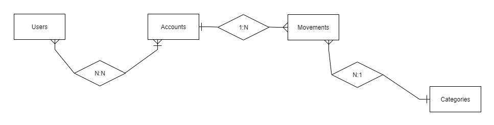

# Descrizione

**myBudget** e’ una applicazione mobile/web per tracciare le spese di un utente e della propria famiglia. 
MyBudget si presenta come il degno sostituto del vecchio quaderno che usavano le famiglie negli anni 90 per tenere traccia delle proprie spese e del bilancio della famiglia. Con mybudget sei in grado di inserire nel sistema le spese con il relativo dettaglio di importo e categoria in modo da fare statistiche e grafici che identificano la tipologia di beni che ha l impatto piu grosso nella tua famiglia.

# Entita del dominio applicativo

Di seguito alcune info sulle entita’ in gioco; per maggiori info guardare lo yaml .
* **USERS**: Entita che rappresenta l utilizzatore del software. Un utente puo iscriversi a mybudget sia con una funzionalita’di registrazione account compilando i suoi dati che utilizzando l apposito login da google o fb.
* **ACCOUNTS**: E’ l entita che rappresenta il portafoglio di un gruppo di uno o piu utenti.
* **MOVEMENTS**: Singola transazione di entrata o uscita su un account. Attributo di rilievo : importo, tipologia ( entrata o uscita) , data del movimento, account, utente esecutore e categoria 
* **CATEGORIES**: Categoria di una spesa o entrata. Ad esempio : Cibo, Stipendio, Sigarette ecc

# Architettura SW

**Backend**: Un servizio che espone API Restful con autenticazione JWT. Un secondo servizio che espone API mqtt websocket

[**Webapp**](https://github.com/ItalianCoders/myBudget-web-frontend): Angular 5

[**Mobile Android**](https://github.com/ItalianCoders/myBudget-mobile-android): Kotlin nativa

**Mobile Ios** : Swift
